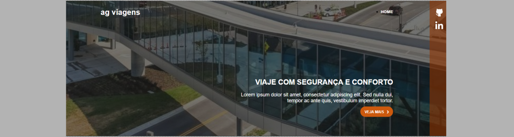
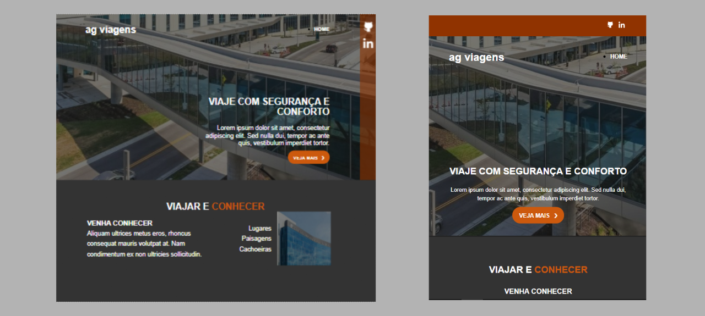

# Site de Viagens

## Sobre o projeto

Projeto: [trabalho de front-end](https://front-end-site-de-viagens.vercel.app/)

Trabalho desenvolvido com tecnologias utilizadas em front-end, observando a estrutura e o visual aplicado.

Work developed with technologies used in front-end, observing the structure and visual applied.

## Layout web e mobile

## Tecnologias Utilizadas

* HTML 5
* CSS 3
* Flexbox

## Autor

#### **Katarine Albuquerque**

    
    &nbsp;
    

